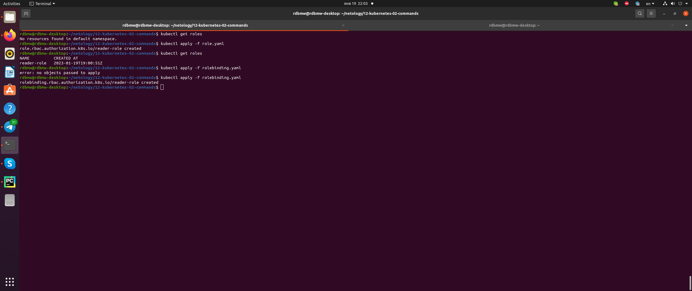

# Домашнее задание к занятию "12.2 Команды для работы с Kubernetes"
Кластер — это сложная система, с которой крайне редко работает один человек. Квалифицированный devops умеет наладить работу всей команды, занимающейся каким-либо сервисом.
После знакомства с кластером вас попросили выдать доступ нескольким разработчикам. Помимо этого требуется служебный аккаунт для просмотра логов.

## Задание 1: Запуск пода из образа в деплойменте

### Вопрос
Для начала следует разобраться с прямым запуском приложений из консоли. Такой подход поможет быстро развернуть инструменты отладки в кластере. Требуется запустить деплоймент на основе образа из hello world уже через deployment. Сразу стоит запустить 2 копии приложения (replicas=2). 

Требования:
 * пример из hello world запущен в качестве deployment
 * количество реплик в deployment установлено в 2
 * наличие deployment можно проверить командой kubectl get deployment
 * наличие подов можно проверить командой kubectl get pods

### Ответ

Опишем [deployment](src/deployment.yaml) в yaml и применим команду ```kubectl apply -f```. Результат:


## Задание 2: Просмотр логов для разработки

### Вопрос
Разработчикам крайне важно получать обратную связь от штатно работающего приложения и, еще важнее, об ошибках в его работе. 
Требуется создать пользователя и выдать ему доступ на чтение конфигурации и логов подов в app-namespace.

Требования: 
 * создан новый токен доступа для пользователя
 * пользователь прописан в локальный конфиг (~/.kube/config, блок users)
 * пользователь может просматривать логи подов и их конфигурацию (kubectl logs pod <pod_id>, kubectl describe pod <pod_id>)

### Ответ

Для аутентификации используем X509. Создадим ключи:

```commandline
$ openssl genrsa -out ~/.cert/devnet.key 2048
$ openssl req -new -key ~/.cert/devnet.key -out ~/.cert/devnet.csr -subj "/CN=devnet"
$ openssl x509 -req -in ~/.cert/devnet.csr -CA ~/.minikube/ca.crt -CAkey ~/.minikube/ca.key -CAcreateserial -out ~/.cert/devnet.crt -days 500
```

Результат:


Добавим в ~/.kube/config пользователя devnet:

```commandline
users:
- name: devnet
  user:
    client-certificate: /home/rdbmw/.cert/devnet.crt
    client-key: /home/rdbmw/.cert/devnet.key
- name: minikube
  user:
    client-certificate: /home/rdbmw/.minikube/profiles/minikube/client.crt
    client-key: /home/rdbmw/.minikube/profiles/minikube/client.key
```

Опишем ресурсы [Role](src/role.yaml) и [RoleBinding](src/rolebinding.yaml) в yaml и применим ```kubectl apply -f```:



Переключим контекст на пользователя devnet ```kubectl config set-context minikube --user=devnet``` и проверим ограниченность прав:


## Задание 3: Изменение количества реплик 

### Вопрос
Поработав с приложением, вы получили запрос на увеличение количества реплик приложения для нагрузки. Необходимо изменить запущенный deployment, увеличив количество реплик до 5. Посмотрите статус запущенных подов после увеличения реплик. 

Требования:
 * в deployment из задания 1 изменено количество реплик на 5
 * проверить что все поды перешли в статус running (kubectl get pods)

### Ответ
Применим команду ```kubectl scale --replicas=5 deployment hello-node```:

